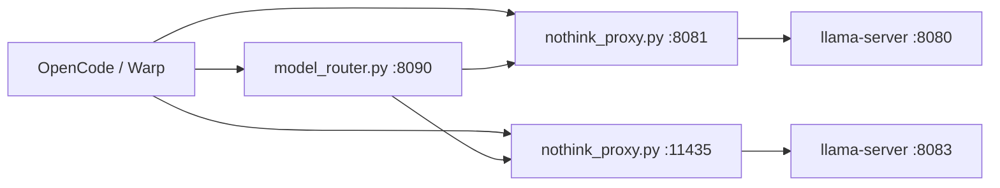

# Architecture

## Overview
`ai-local-dev` exposes stable OpenAI-compatible local endpoints for **llama.cpp (27B + 35B)** with think-control through a unified proxy. llama.cpp exposes the hybrid Gated-DeltaNet cache checkpoint flags the Qwen3.6 architecture needs for fast multi-turn agentic workloads, plus MTP speculative decoding (on by default).

## High-level flow

## Components

### `bin/ai-local`
Primary orchestrator. Key responsibilities:

- starts/stops model backends and proxies
- maintains PID files under `~/.local/state/ai-local/run/`
- writes logs under `~/.local/state/ai-local/logs/`
- updates `~/.qwen/settings.json` for Warp/qwen-code integration

### `bin/__proxy.py`
Unified nothink proxy for 27B/35B with a llama.cpp upstream.

- upstream: `LLAMA_PORT` for 27B, `LLAMA_35B_PORT` for 35B
- request mutation:
  - `chat_template_kwargs.enable_thinking=false` (template-level switch)
  - `enable_thinking=false` (legacy fallback)
- `preserve_thinking` is set **server-side** by llama-server via `--chat-template-kwargs` (not injected by the proxy) so the checkpoint cache can reuse prefixes across turns when thinking is on. The proxy's nothink `enable_thinking=false` is orthogonal — it only governs whether the *current* turn reasons.
- response mutation in nothink mode:
  - strips `` from JSON and SSE chunks
- exposes `/health` and `/v1/models` pass-throughs

### `bin/model_router.py`
Optional helper endpoint that dispatches to the 27B or 35B proxy by requested `model` hint (`planner` vs `coder`).

### Backends
- **27B**: `llama-server` on `LLAMA_PORT` (default `8080`) with 64K context, Q4_K_XL, hybrid checkpoint + SWA flags, MTP on by default
- **35B-A3B**: `llama-server` on `LLAMA_35B_PORT` (default `8083`) with 128K context, Q4_K_XL + MTP (on by default)

### llama.cpp hybrid-cache + MTP flags
Both llama-server backends launch with the same flag block (see `bin/ai-local:llama_hybrid_flags`):

- `--flash-attn on --cache-type-k q8_0 --cache-type-v q8_0` — flash attention + Q8 KV cache
- `--swa-full` — bounded KV for the sliding-window-attention layers (memory-efficient long context)
- `--ctx-checkpoints $LLAMA_CTX_CHECKPOINTS` — 40–80× warm-turn prefill speedup by reusing cached prefixes across turns (the multi-turn agentic perf fix). `--checkpoint-every-n-tokens` was removed in llama.cpp build 9750; the interval is now auto-determined by `llama-server` (`LLAMA_CHECKPOINT_EVERY_N_TOKENS` is kept in config for documentation only).
- `--chat-template-kwargs {"preserve_thinking": true}` — keeps reasoning in history so checkpoint prefixes match across turns (required when thinking is on)
- `--spec-type draft-mtp --spec-draft-n-max N` — MTP speculative decode (27B N=3, 35B N=2). Emitted only when `LLAMA_MTP=1` and an MTP GGUF is present. On by default (`LLAMA_MTP=1`): a real net decode speedup on Apple Silicon/Metal (measured +42% on the 27B dense and +23% on the 35B-A3B MoE on M3 Max — see `bench/README.md`). Set `LLAMA_MTP=0` to skip the MTP draft context (saves a little RAM).

## Think-control behavior
- default: thinking disabled in proxy
- force thinking: `AI_LOCAL_FORCE_THINK=1` before starting stack
- legacy alias still supported: `LLAMA_PROXY_FORCE_THINK`

## Configuration model
Defaults live in `config/.qwen-local.conf`, and local overrides are loaded from `config/.qwen-local.conf.local` when present.

Important keys:

- `QWEN_27B_MODEL`, `QWEN_27B_MTP_MODEL`
- `QWEN_35B_MODEL`, `QWEN_35B_MTP_MODEL`
- `LLAMA_PORT`, `LLAMA_35B_PORT`, `LLAMA_PROXY_PORT`, `PROXY_35B_PORT`
- `LLAMA_CTX_SIZE` (27B, default 65536), `LLAMA_35B_CTX_SIZE` (35B, default 131072)
- `LLAMA_CACHE_TYPE_K/V` (default `q8_0`)
- `LLAMA_CTX_CHECKPOINTS`, `LLAMA_CHECKPOINT_EVERY_N_TOKENS`, `LLAMA_SWA_FULL`
- `LLAMA_MTP`, `LLAMA_MTP_N_MAX_27B`, `LLAMA_MTP_N_MAX_35B`, `LLAMA_PRESERVE_THINKING`
- `AI_LOCAL_FORCE_THINK`
- `AI_LOCAL_STATE_DIR`, `AI_LOCAL_LOG_DIR`, `AI_LOCAL_RUN_DIR`

## Security and locality
- all services bind to `127.0.0.1`
- no external auth expected for localhost usage
- credentials from client `Authorization` headers are stripped before upstream forwarding
