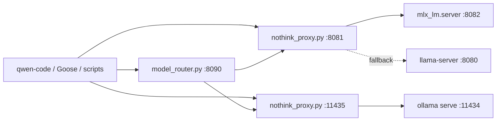

# Architecture

## Overview
`ai-local-dev` exposes stable OpenAI-compatible local endpoints while allowing backend switching (MLX or llama.cpp for 27B, Ollama for 8B/35B) and think-control through a unified proxy.

## High-level flow

## Components

### `bin/ai-local`
Primary orchestrator command. Key responsibilities:

- starts/stops model backends and proxies
- manages backend selection via `BACKEND_27B={mlx|llama}`
- maintains PID files under `~/.local/state/ai-local/run/`
- writes logs under `~/.local/state/ai-local/logs/`
- updates `~/.qwen/settings.json` and `config/goose/config.yaml`

### `bin/nothink_proxy.py`
Unified proxy for 27B and shared Ollama stacks (8B/35B).

- mode `llama`: used for 27B (MLX or llama.cpp upstream)
- mode `ollama`: used for 8B/35B upstream
- request mutation:
  - `chat_template_kwargs.enable_thinking=false` (template-level switch)
  - `enable_thinking=false` (legacy fallback)
  - `think=false` and `reasoning_effort=none` (Ollama defense-in-depth)
- response mutation in nothink mode:
  - strips `<think>...</think>` from JSON and SSE chunks
- exposes `/health` and `/v1/models` pass-throughs

### `bin/model_router.py`
Optional helper endpoint that dispatches to 27B or shared Ollama proxy by requested `model` hint (`planner` vs `coder`).

### Backends
- 27B primary: `mlx_lm.server` on `MLX_PORT` (default `8082`)
- 27B fallback: `llama-server` on `LLAMA_PORT` (default `8080`)
- 8B: Ollama on `OLLAMA_PORT` (default `11434`) via `OLLAMA_PROXY_PORT` (default `11435`)
- 35B: Ollama on `OLLAMA_PORT` (default `11434`) via `OLLAMA_PROXY_PORT` (default `11435`)

## Think-control behavior
- default: thinking disabled in proxy
- force thinking: `AI_LOCAL_FORCE_THINK=1` before starting stack
- backward-compatible aliases still supported:
  - `LLAMA_PROXY_FORCE_THINK`
  - `OLLAMA_PROXY_FORCE_THINK`
  - `OLLAMA_PROXY_THINK`

Verification script: `bin/verify_nothink.sh`

## Configuration model
Defaults live in `config/.qwen-local.conf`, and local overrides are loaded from `config/.qwen-local.conf.local` when present.

Important keys:

- `BACKEND_27B`
- `QWEN_27B_MLX_MODEL`
- `QWEN_27B_MODEL`
- `QWEN_8B_OLLAMA_MODEL`
- `AI_LOCAL_FORCE_THINK`
- `AI_LOCAL_STATE_DIR`, `AI_LOCAL_LOG_DIR`, `AI_LOCAL_RUN_DIR`

## Security and locality
- all services bind to `127.0.0.1`
- no external auth expected for localhost usage
- credentials from client `Authorization` headers are stripped before upstream forwarding
